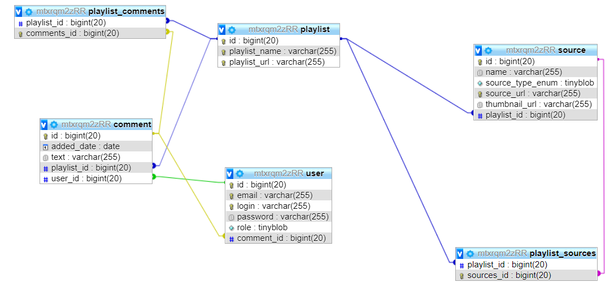

Baza tutoriali dla przyszłych juniorów

Krótki opis systemu:
Aplikacja, której celem jest gromadzenie wiedzy w postaci tutoriali, linków wraz z własnymi komentarzami, dzięki czemu możemy przechowywać wiedzę na dany temat w jednym miejscu. Każdy zbiór wiedzy możesz przesłać innemu użytkownikowi.
Główne funkcje systemu: 

- Rejestracja kont użytkowników 

- Panel administracyjny

 -Dodawanie i usuwanie linków 

- Możliwość dodawania komentarzy do linków/plików

 -Dzielenie się zbiorami wiedzy z innymi użytkownikami 

 - Podział wiedzy na kategorie 

Technologie: 

-	Spring 
-	Hibernate.
-	Vaadin
-	React?

Podstawowe byty:

1.	Encje

Użytkownik
Hasło (BCryptPasswordEncoder)
Email
Login
Rola

Zbiór wiedzy
Nazwa
Komentarz
Link do zbioru wiedzy

Wiedza 
Nazwa(dla filmików pobierane automatycznie, dla stron może też)
Link do źródła
Zbiór wiedzy
Rodzaj
Komentarz
Miniaturka

Komentarz 
Udzielający (Użytkownik)
Treść
Data

Rys.1 Diagram klas

2.	Interfejs
Panel logowania
Login
Hasło
Panel administratora
Widok użytkowników
Usuwanie użytkowników
Strona główna
Lista zbiorów wiedzy
Przycisk wyloguj
Strona zbioru wiedzy
Lista wiedzy(usuwanie, dodawanie, dodawanie komentarzy)
Przycisk powrót na stronę główną

Funkcjonalności:

Rejestracja konta użytkownika:
- formularz posiada pola email, hasło oraz login
- formularz przypomnienia hasła z polem email – podanie poprawnego wysyła nowy email z hasłem
Zarządzanie kategoriami(strona główna):
- zalogowany użytkownik może stworzyć kategorię wiedzy
- formularz dodawania kategorii ma pole treść
- użytkownik ma możliwość wysłania linka do zbioru wiedzy do innego użytkownika
- formularz wysyłania linka do zbioru wiedzy dalej(?)
- możliwość wyszukiwania po kategorii oraz po konkretnym źródle wiedzy
- użytkownik ma możliwość edycji/usuwania kategorii
Zarządzanie wiedzą:
- użytkownik ma możliwość dodania linku do nowego źródła wiedzy
- formularz dodawania linków ma pole typu tekstowego dla linka oraz pole treść dla komentarza
- użytkownik ma możliwość edycji źródła oraz jego usuwania
Panel administracyjny:
- administrator ma podgląd na listę zalogowanych użytkowników
- możliwość usuwania użytkowników
